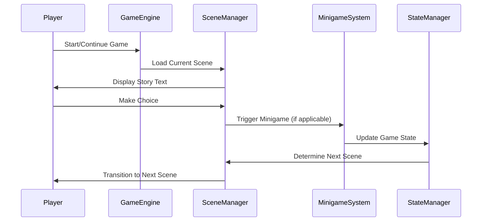

# Design Document: Complete Birthday Adventure Game

## Overview

This design covers the completion of an interactive text-based birthday adventure game. The game takes the player through nostalgic franchises (Breaking Bad, Alice in Wonderland, Hitchhiker's Guide, Wings of Fire) with a thematic arc about aging, memory, and acceptance. Chapter 1 (Amelia Project intake) is complete, Chapter 2 (Breaking Bad) is partially implemented. This spec focuses on completing Chapters 2-4, implementing all minigames, and creating the final birthday reveal.

## Main Architecture Flow



## Core Components and Interfaces

### Component 1: Scene Manager

**Purpose**: Manages scene transitions, story progression, and narrative flow

**Interface**:
```javascript
interface SceneManager {
  playScene(sceneId: string): Promise<void>
  clearStory(): void
  addMessage(speaker: string, text: string, isHtml: boolean): Promise<void>
  showChoices(choices: Choice[]): void
  showInput(placeholder: string, buttonText: string, onsubmit: Function): void
  changeVibe(themeName: string, bgImage: string | null): void
}

interface Choice {
  text: string
  nextScene?: string
  onClick?: Function
}
```

**Responsibilities**:
- Load and display scene content with typewriter effect
- Handle player choices and route to next scenes
- Manage theme transitions between chapters
- Coordinate with minigame system

### Component 2: Minigame System

**Purpose**: Implements interactive gameplay mechanics for each chapter

**Interface**:
```javascript
interface MinigameSystem {
  launchFlaskSelection(): Promise<string>
  launchEquationBalancer(): Promise<boolean>
  launchWitnessSelection(): Promise<number>  // Returns sympathy score
  launchSliderTrial(): Promise<number>  // Returns verdict score
  launchVogonForm(): Promise<boolean>
  launchDecreeSelection(): Promise<string[]>
  launchLifeboatSelection(): Promise<object>
}

interface MinigameResult {
  success: boolean
  score?: number
  data?: any
}
```

**Responsibilities**:
- Render interactive minigame UI
- Capture player input and validate
- Calculate scores/outcomes
- Return results to scene manager

### Component 3: State Manager

**Purpose**: Tracks player progress, choices, and game state across chapters

**Interface**:
```javascript
interface StateManager {
  playerName: string
  playerAvatar: string
  currentChapter: number
  choices: Map<string, any>
  
  saveChoice(key: string, value: any): void
  getChoice(key: string): any
  saveProgress(): void
  loadProgress(): void
}
```

**Responsibilities**:
- Persist player name, avatar, and choices
- Track chapter progression
- Enable undo/rewind functionality
- Store minigame outcomes

### Component 4: Theme Controller

**Purpose**: Manages visual theming for each chapter

**Interface**:
```javascript
interface ThemeController {
  applyTheme(themeName: string): void
  setBackgroundImage(imagePath: string): void
  transitionTheme(fromTheme: string, toTheme: string, duration: number): void
}
```

**Responsibilities**:
- Apply CSS theme variables
- Handle background image overlays
- Smooth transitions between chapters
- Maintain theme consistency

## Data Models

### Model 1: Scene

```javascript
interface Scene {
  id: string
  chapter: number
  messages: Message[]
  choices?: Choice[]
  minigame?: MinigameConfig
  nextScene?: string
  theme?: string
  backgroundImage?: string
}

interface Message {
  speaker: string
  text: string
  isHtml?: boolean
  delay?: number
}
```

**Validation Rules**:
- Scene ID must be unique
- Chapter number must be 1-5
- At least one message or minigame required
- If no choices provided, nextScene must be specified

### Model 2: MinigameConfig

```javascript
interface MinigameConfig {
  type: 'flask' | 'equation' | 'witness' | 'slider' | 'vogon' | 'decree' | 'lifeboat'
  config: object
  onComplete: (result: MinigameResult) => void
  onFail?: (attempts: number) => void
}
```

**Validation Rules**:
- Type must match implemented minigame
- Config must contain required fields for minigame type
- onComplete callback is required

### Model 3: GameState

```javascript
interface GameState {
  playerName: string
  playerAvatar: string
  currentScene: string
  currentChapter: number
  choices: Map<string, any>
  minigameResults: Map<string, MinigameResult>
  timestamp: number
}
```

**Validation Rules**:
- PlayerName cannot be empty
- CurrentScene must exist in scenes object
- Timestamp must be valid Unix timestamp

## Algorithmic Pseudocode

### Main Scene Progression Algorithm

```pascal
ALGORITHM playScene(sceneId)
INPUT: sceneId of type string
OUTPUT: void (async operation)

PRECONDITIONS:
  - sceneId exists in scenes object
  - Game engine is initialized
  - Story area and interactive area are available in DOM

POSTCONDITIONS:
  - Scene content is displayed to player
  - Interactive elements (choices/minigames) are rendered
  - Game state is updated with current scene
  - Theme is applied if scene specifies theme change

BEGIN
  // Clear previous content
  clearStory()
  clearInteractive()
  
  // Get scene definition
  scene ← scenes[sceneId]
  
  ASSERT scene IS NOT NULL
  
  // Apply theme if specified
  IF scene.theme IS NOT NULL THEN
    changeVibe(scene.theme, scene.backgroundImage)
  END IF
  
  // Display all messages sequentially
  FOR EACH message IN scene.messages DO
    AWAIT addMessage(message.speaker, message.text, message.isHtml)
    
    IF message.delay IS NOT NULL THEN
      AWAIT sleep(message.delay)
    END IF
  END FOR
  
  // Handle interactive elements
  IF scene.minigame IS NOT NULL THEN
    result ← AWAIT launchMinigame(scene.minigame)
    scene.minigame.onComplete(result)
  ELSE IF scene.choices IS NOT NULL THEN
    showChoices(scene.choices)
  ELSE IF scene.nextScene IS NOT NULL THEN
    playScene(scene.nextScene)
  END IF
  
  // Update game state
  state.currentScene ← sceneId
  saveProgress()
END
```

**Loop Invariants**:
- All previously displayed messages remain visible in story area
- Game state remains consistent throughout scene display
- Theme variables remain applied until next theme change

### Flask Selection Minigame Algorithm

```pascal
ALGORITHM launchFlaskSelection()
INPUT: none
OUTPUT: selectedFlask of type string

PRECONDITIONS:
  - Interactive area is cleared
  - Flask images are available in static/images/
  - Player can see and interact with UI

POSTCONDITIONS:
  - Returns selected flask type
  - If correct flask selected, game continues
  - If incorrect flask selected, game over scene triggered
  - Visual feedback provided for selection

BEGIN
  flaskOptions ← ["volumetric", "conical", "round-bottom"]
  correctFlask ← "round-bottom"
  
  // Render flask selection UI
  FOR EACH flask IN flaskOptions DO
    button ← createButton(flask)
    button.image ← loadImage("static/images/" + flask + "_flask.png")
    button.onClick ← handleFlaskSelection(flask)
    interactiveArea.appendChild(button)
  END FOR
  
  // Wait for player selection
  selectedFlask ← AWAIT waitForSelection()
  
  // Validate selection
  IF selectedFlask = correctFlask THEN
    playSFX("static/audio/success.mp3")
    RETURN selectedFlask
  ELSE
    playSFX("static/audio/glass_shatter.mp3")
    playScene("chapter2_flask_fail")
    RETURN NULL
  END IF
END
```

**Preconditions**:
- Flask images exist in static/images/ directory
- Audio files exist for feedback
- Interactive area is empty and ready for content

**Postconditions**:
- Exactly one flask is selected
- Appropriate audio feedback is played
- Game progresses to next scene based on selection

### Equation Balancing Minigame Algorithm

```pascal
ALGORITHM launchEquationBalancer()
INPUT: none
OUTPUT: success of type boolean

PRECONDITIONS:
  - Interactive area is cleared
  - Player has basic chemistry knowledge (or can guess)
  - Equation template is defined: __ CH₃NH₂ + __ O₂ → __ CO₂ + __ H₂O + __ N₂

POSTCONDITIONS:
  - Returns true if equation balanced correctly within 7 attempts
  - Returns false if 7 attempts exhausted
  - Provides progressive hints after each failed attempt
  - Visual feedback for correct/incorrect attempts

BEGIN
  equation ← "__ CH₃NH₂ + __ O₂ → __ CO₂ + __ H₂O + __ N₂"
  correctAnswer ← [4, 9, 4, 10, 2]
  attempts ← 0
  maxAttempts ← 7
  hints ← [
    "Try again.",
    "The atoms have to balance. The atoms always balance.",
    "You said this one knew chemistry.",
    "Count the nitrogens. Then the carbons. Then the hydrogens. Oxygen comes last.",
    "I'll give you the nitrogens. Two on the right. Work backward.",
    "I am genuinely starting to lose respect for you.",
    "Four. Nine. Four. Ten. Two. Try not to forget it."
  ]
  
  // Render equation input UI
  renderEquationInputs(equation)
  
  WHILE attempts < maxAttempts DO
    // Wait for player submission
    playerAnswer ← AWAIT waitForSubmission()
    attempts ← attempts + 1
    
    // Check if correct
    IF playerAnswer = correctAnswer THEN
      playSFX("static/audio/success.mp3")
      displayMessage("Walt", "Wonderful.")
      RETURN true
    ELSE
      // Show hint based on attempt number
      displayMessage("Walt", hints[attempts - 1])
      
      IF attempts < maxAttempts THEN
        // Allow retry
        clearInputs()
      ELSE
        // Max attempts reached
        displayMessage("Walt", "I'm disappointed.")
        RETURN false
      END IF
    END IF
  END WHILE
END
```

**Loop Invariants**:
- attempts ≤ maxAttempts throughout execution
- Each failed attempt increments attempts by exactly 1
- Hints array index matches attempts - 1
- Player always has opportunity to retry until maxAttempts reached

### Witness Selection Minigame Algorithm

```pascal
ALGORITHM launchWitnessSelection()
INPUT: none
OUTPUT: sympathyScore of type integer

PRECONDITIONS:
  - Player is in Alice in Wonderland courtroom scene
  - Three rounds of witness selection available
  - Sympathy meter initialized at 0
  - Need 5+ sympathy to win

POSTCONDITIONS:
  - Returns total sympathy score (0-9 range)
  - Each witness contributes 0-4 sympathy points
  - Visual sympathy meter updates after each selection
  - Outcome determines counter-coup success or failure

BEGIN
  sympathyScore ← 0
  targetSympathy ← 5
  rounds ← 3
  
  witnessOptions ← [
    // Round 1
    [
      {name: "Hedgehog", sympathy: 2},
      {name: "Pocketwatch", sympathy: 1},
      {name: "Cake", sympathy: 0}
    ],
    // Round 2 (after Queen's witness)
    [
      {name: "Cheshire Cat", sympathy: 3},
      {name: "March Hare", sympathy: 1},
      {name: "Caterpillar", sympathy: 2}
    ],
    // Round 3 (kill shot)
    [
      {name: "Alice", sympathy: 2},
      {name: "Flamingo", sympathy: 3},
      {name: "The Queen", sympathy: 4}
    ]
  ]
  
  // Initialize sympathy meter UI
  renderSympathyMeter(sympathyScore, targetSympathy)
  
  FOR round ← 1 TO rounds DO
    // Display witness options for this round
    displayWitnessOptions(witnessOptions[round - 1])
    
    // Wait for player selection
    selectedWitness ← AWAIT waitForWitnessSelection()
    
    // Add sympathy points
    sympathyScore ← sympathyScore + selectedWitness.sympathy
    
    // Update meter with animation
    updateSympathyMeter(sympathyScore)
    
    // Display witness testimony
    displayWitnessTestimony(selectedWitness)
    
    // Special event after round 1: Queen calls her witness
    IF round = 1 THEN
      displayQueenWitness()
      sympathyScore ← sympathyScore + 1  // Free sympathy point
      updateSympathyMeter(sympathyScore)
    END IF
  END FOR
  
  // Determine outcome
  IF sympathyScore >= targetSympathy THEN
    playScene("chapter3_counter_coup_win")
  ELSE
    playScene("chapter3_counter_coup_lose")
  END IF
  
  RETURN sympathyScore
END
```

**Preconditions**:
- Witness options are defined with sympathy values
- Sympathy meter UI component is available
- Player can see and select witnesses

**Postconditions**:
- Exactly 3 witnesses are called
- Sympathy score is sum of all selected witness values plus Queen's witness bonus
- Outcome scene is triggered based on final score
- Sympathy meter accurately reflects final score

### Slider Trial Minigame Algorithm

```pascal
ALGORITHM launchSliderTrial()
INPUT: none
OUTPUT: verdictScore of type integer

PRECONDITIONS:
  - Player is in Chapter 3B jury duty scene
  - 10 arguments will be presented (5 per side)
  - Slider range is -5 to +5 for each argument
  - Optional counter-argument text input available

POSTCONDITIONS:
  - Returns total verdict score (sum of all slider values)
  - Positive score favors plaintiff (Aang)
  - Negative score favors defendant (Voldemort)
  - Counter-arguments are captured for potential use in final scene

BEGIN
  verdictScore ← 0
  arguments ← [
    {speaker: "Campbell", text: "Opening for Aang...", side: "plaintiff"},
    {speaker: "Saul", text: "Opening for Voldemort...", side: "defense"},
    // ... 8 more arguments
  ]
  counterArguments ← []
  
  FOR EACH argument IN arguments DO
    // Display argument
    displayArgument(argument.speaker, argument.text)
    
    // Render slider (-5 to +5)
    slider ← createSlider(-5, 5, 0)
    slider.labels ← ["Does not land", "Neutral", "Lands perfectly"]
    
    // Render optional counter-argument input
    counterInput ← createTextArea("Your counter-argument (optional)")
    
    // Wait for player rating
    rating ← AWAIT waitForSliderSubmission(slider)
    counterText ← counterInput.value
    
    // Store results
    verdictScore ← verdictScore + rating
    
    IF counterText IS NOT EMPTY THEN
      counterArguments.push({
        argument: argument.text,
        counter: counterText,
        rating: rating
      })
    END IF
    
    // Visual feedback
    displayRatingFeedback(rating)
  END FOR
  
  // Determine verdict
  IF verdictScore > 0 THEN
    verdict ← "plaintiff"
  ELSE IF verdictScore < 0 THEN
    verdict ← "defendant"
  ELSE
    verdict ← "hung_jury"
  END IF
  
  // Store for later use
  state.saveChoice("trial_verdict", verdict)
  state.saveChoice("counter_arguments", counterArguments)
  
  RETURN verdictScore
END
```

**Loop Invariants**:
- verdictScore is cumulative sum of all previous ratings
- counterArguments array grows by 0 or 1 each iteration
- Slider always resets to 0 (neutral) for each new argument

### Vogon Form 27-B-Stroke-6 Algorithm

```pascal
ALGORITHM launchVogonForm()
INPUT: none
OUTPUT: success of type boolean

PRECONDITIONS:
  - Player is on Vogon ship in Chapter 4C
  - Form has 7 fields
  - Correct answer for all fields is "42"
  - Player may not know this initially

POSTCONDITIONS:
  - Returns true if all 7 fields completed with "42"
  - Provides bureaucratic rejection messages for incorrect answers
  - Ford provides hint after 5 failed attempts on any field
  - Boarding pass issued upon completion

BEGIN
  fields ← [
    "SPECIES OF ORIGIN",
    "PLANET OF ORIGIN",
    "PRIMARY PURPOSE OF EXISTENCE",
    "EMERGENCY CONTACT",
    "FEELINGS REGARDING DEMOLITION",
    "ARE YOU CARRYING A TOWEL",
    "PREFERRED CONTINENT FOR EVACUATION"
  ]
  
  correctAnswer ← "42"
  completedFields ← 0
  totalFailures ← 0
  hintGiven ← false
  
  rejectionMessages ← {
    "SPECIES OF ORIGIN": {
      "Human": "Too squishy. The form requires your numerical cosmic designation.",
      "default": "Unregistered biological anomaly. Please quantify."
    },
    "PLANET OF ORIGIN": {
      "Earth": "Earth is a soil type, not a coordinate. The bureau requires standard existential metrics.",
      "default": "Unrecognized localized slang."
    },
    // ... rejection messages for other fields
  }
  
  // Render form UI
  renderVogonForm(fields)
  
  FOR EACH field IN fields DO
    fieldComplete ← false
    fieldAttempts ← 0
    
    WHILE NOT fieldComplete DO
      // Wait for player input
      answer ← AWAIT waitForFieldSubmission(field)
      
      IF answer = correctAnswer THEN
        // Stamp and accept
        playSFX("static/audio/stamp.mp3")
        displayStamp("ACCEPTED")
        fieldComplete ← true
        completedFields ← completedFields + 1
        
        // After 3 correct answers, form provides hint
        IF completedFields = 3 THEN
          displayFormMessage("The form detects an administrative pattern. The form strongly approves of patterns. All subsequent fields will accept the constant.")
        END IF
      ELSE
        // Reject with bureaucratic message
        rejection ← getRejectionMessage(field, answer, rejectionMessages)
        displayRejection(rejection)
        fieldAttempts ← fieldAttempts + 1
        totalFailures ← totalFailures + 1
        
        // Ford intervenes after 5 total failures
        IF totalFailures >= 5 AND NOT hintGiven THEN
          displayFordHint("The integer between forty-one and forty-three? Just type it. Type it for everything.")
          hintGiven ← true
        END IF
      END IF
    END WHILE
  END FOR
  
  // Issue boarding pass
  displayBoardingPass("GUEST")
  
  RETURN true
END
```

**Preconditions**:
- Form fields are defined with rejection messages
- Audio file for stamp sound exists
- Ford hint is available after threshold

**Postconditions**:
- All 7 fields are completed with "42"
- Boarding pass is issued
- Player understands the pattern (hopefully)

## Key Functions with Formal Specifications

### Function 1: addMessage()

```javascript
async function addMessage(speaker, text, isHtml = false)
```

**Preconditions:**
- `speaker` is non-empty string or valid speaker identifier
- `text` is non-empty string containing message content
- `storyArea` DOM element exists and is accessible
- If `isHtml` is true, `text` contains valid HTML

**Postconditions:**
- Message is appended to story area with proper styling
- Speaker avatar is displayed if available
- Text is rendered with typewriter effect (unless isHtml is true)
- Story area scrolls to show new message
- Promise resolves when message display is complete

**Loop Invariants:** N/A (no loops in function body)

### Function 2: showChoices()

```javascript
function showChoices(choices)
```

**Preconditions:**
- `choices` is non-empty array of Choice objects
- Each choice has `text` property
- Each choice has either `nextScene` or `onClick` property
- `interactiveArea` DOM element exists

**Postconditions:**
- Interactive area is cleared of previous content
- One button created for each choice
- Each button has click handler that triggers fade-out transition
- After transition, either `onClick` callback or `playScene(nextScene)` is called
- Buttons are styled according to current theme

**Loop Invariants:**
- All previously processed choices have buttons in interactive area
- Each button has exactly one click handler attached

### Function 3: launchMinigame()

```javascript
async function launchMinigame(minigameConfig)
```

**Preconditions:**
- `minigameConfig.type` matches implemented minigame type
- `minigameConfig.config` contains required fields for minigame
- `minigameConfig.onComplete` is valid callback function
- Interactive area is available for minigame UI

**Postconditions:**
- Minigame UI is rendered in interactive area
- Player can interact with minigame
- Minigame validates player input
- Result is returned when minigame completes
- `onComplete` callback is invoked with result
- Interactive area is cleared after minigame

**Loop Invariants:**
- Minigame state remains consistent during player interaction
- Score/progress is accurately tracked throughout minigame

## Example Usage

```javascript
// Example 1: Playing a simple scene with choices
const scenes = {
  example_scene: async () => {
    await addMessage('Narrator', 'You stand at a crossroads.');
    await addMessage('Narrator', 'Two paths lie before you.');
    
    showChoices([
      { text: 'Take the left path', nextScene: 'left_path' },
      { text: 'Take the right path', nextScene: 'right_path' }
    ]);
  }
};

// Example 2: Scene with minigame
const scenes = {
  chemistry_test: async () => {
    await addMessage('Walt', 'Balance this equation.');
    
    const success = await launchEquationBalancer();
    
    if (success) {
      playScene('chemistry_success');
    } else {
      playScene('chemistry_failure');
    }
  }
};

// Example 3: Theme transition
const scenes = {
  chapter_transition: async () => {
    await addMessage('System', 'The world shifts around you...');
    
    storyArea.classList.add('fade-out');
    
    setTimeout(() => {
      clearStory();
      changeVibe('chapter3', null);
      playScene('chapter3_start');
    }, 2000);
  }
};
```

## Correctness Properties

### Property 1: Scene Progression Integrity
**Universal Quantification**: For all scenes S in the game, if S is played, then exactly one of the following must occur:
- S displays choices and waits for player input
- S launches a minigame and waits for completion
- S automatically transitions to nextScene

**Formal Statement**: ∀S ∈ Scenes: played(S) ⟹ (hasChoices(S) ⊕ hasMinigame(S) ⊕ hasNextScene(S))

### Property 2: State Consistency
**Universal Quantification**: For all game states G, the current scene must exist in the scenes object and the current chapter must match the scene's chapter.

**Formal Statement**: ∀G ∈ GameStates: scenes[G.currentScene] ≠ null ∧ scenes[G.currentScene].chapter = G.currentChapter

### Property 3: Minigame Completion
**Universal Quantification**: For all minigames M, if M is launched, then M must eventually return a result or timeout.

**Formal Statement**: ∀M ∈ Minigames: launched(M) ⟹ ◇(completed(M) ∨ timeout(M))

### Property 4: Theme Application
**Universal Quantification**: For all scenes S with a theme property, when S is played, the theme must be applied before messages are displayed.

**Formal Statement**: ∀S ∈ Scenes: (S.theme ≠ null ∧ played(S)) ⟹ themeApplied(S.theme) before messagesDisplayed(S)

### Property 5: Choice Uniqueness
**Universal Quantification**: For all choice sets C displayed to the player, each choice must have a unique action (either unique nextScene or unique onClick handler).

**Formal Statement**: ∀C ∈ ChoiceSets: ∀c₁, c₂ ∈ C: c₁ ≠ c₂ ⟹ action(c₁) ≠ action(c₂)

## Error Handling

### Error Scenario 1: Missing Scene

**Condition**: playScene() called with sceneId that doesn't exist in scenes object
**Response**: Log error to console, display error message to player, offer restart option
**Recovery**: Provide "Return to Last Checkpoint" button that loads previous valid scene

### Error Scenario 2: Missing Asset

**Condition**: Image, audio, or other asset file not found
**Response**: Use fallback placeholder (SVG for images, silence for audio), log warning
**Recovery**: Game continues without asset, no crash

### Error Scenario 3: Minigame Timeout

**Condition**: Player inactive for 5+ minutes during minigame
**Response**: Display "Are you still there?" prompt with continue/restart options
**Recovery**: Resume minigame from current state or restart minigame

### Error Scenario 4: Invalid Player Input

**Condition**: Player submits empty or invalid input in text field
**Response**: Display validation message, highlight field, prevent submission
**Recovery**: Player corrects input and resubmits

### Error Scenario 5: State Corruption

**Condition**: localStorage data is corrupted or invalid
**Response**: Clear corrupted state, restart from beginning, notify player
**Recovery**: Offer to start fresh game with apology message

## Testing Strategy

### Unit Testing Approach

Test each core function in isolation:
- `addMessage()`: Verify message rendering, typewriter effect, avatar display
- `showChoices()`: Verify button creation, click handlers, transitions
- `playScene()`: Verify scene loading, message sequencing, choice display
- `launchMinigame()`: Verify each minigame type launches correctly
- `changeVibe()`: Verify theme application, CSS variable updates

**Key Test Cases**:
- Empty/null inputs
- Boundary values (e.g., maxAttempts in equation balancer)
- Async operation completion
- DOM manipulation correctness

### Property-Based Testing Approach

**Property Test Library**: fast-check (JavaScript)

**Property 1: Scene Progression Never Deadlocks**
```javascript
// For any valid scene, playing it should eventually complete
fc.assert(
  fc.property(fc.constantFrom(...Object.keys(scenes)), async (sceneId) => {
    const timeout = new Promise((_, reject) => 
      setTimeout(() => reject('Timeout'), 5000)
    );
    const scenePlay = playScene(sceneId);
    
    // Scene should complete or wait for input, not hang
    await Promise.race([scenePlay, timeout]);
    return true;
  })
);
```

**Property 2: Minigame Results Are Deterministic**
```javascript
// Given same inputs, minigame should produce same result
fc.assert(
  fc.property(
    fc.array(fc.integer(0, 10), {minLength: 5, maxLength: 5}),
    (inputs) => {
      const result1 = validateEquation(inputs);
      const result2 = validateEquation(inputs);
      return result1 === result2;
    }
  )
);
```

**Property 3: State Saves Are Reversible**
```javascript
// Saving and loading state should preserve all data
fc.assert(
  fc.property(
    fc.record({
      playerName: fc.string(),
      currentScene: fc.constantFrom(...Object.keys(scenes)),
      choices: fc.dictionary(fc.string(), fc.anything())
    }),
    (state) => {
      saveState(state);
      const loaded = loadState();
      return JSON.stringify(state) === JSON.stringify(loaded);
    }
  )
);
```

### Integration Testing Approach

Test complete user flows:
- **Flow 1**: Complete Chapter 2 from start to finish
- **Flow 2**: Counter-coup path in Chapter 3
- **Flow 3**: Jury duty path in Chapter 3B
- **Flow 4**: Vogon ship sequence in Chapter 4C
- **Flow 5**: Dragon mountain sequence in Chapter 4B
- **Flow 6**: Complete game from start to birthday reveal

**Integration Test Scenarios**:
- Player makes all "correct" choices
- Player makes all "wrong" choices
- Player uses undo/rewind feature
- Player refreshes page mid-game
- Player completes game multiple times

## Performance Considerations

- **Typewriter Effect**: Optimize character-by-character rendering to avoid layout thrashing
- **Asset Loading**: Preload images and audio for upcoming scenes
- **State Persistence**: Debounce localStorage writes to avoid excessive I/O
- **Animation Performance**: Use CSS transforms instead of position changes
- **Memory Management**: Clean up event listeners when scenes change
- **Mobile Optimization**: Ensure touch events work smoothly, test on various screen sizes

## Security Considerations

- **XSS Prevention**: Sanitize any user input before displaying (player name, counter-arguments)
- **localStorage Limits**: Handle quota exceeded errors gracefully
- **Asset Validation**: Verify asset URLs before loading
- **Input Validation**: Validate all minigame inputs on client side
- **No Sensitive Data**: Game contains no PII or sensitive information

## Dependencies

- **External Libraries**: None (vanilla JavaScript)
- **Browser APIs**: 
  - localStorage (for state persistence)
  - Canvas API (for Space Blasters minigame)
  - Audio API (for sound effects and music)
  - CSS Custom Properties (for theming)
- **Fonts**: 
  - Google Fonts: Outfit, Playfair Display
- **Assets**:
  - Images: Character avatars, flask images, background images
  - Audio: SFX (glass shatter, stamp, success), music (Sid Sriram track)
- **Browser Compatibility**: Modern browsers (Chrome 90+, Firefox 88+, Safari 14+, Edge 90+)
